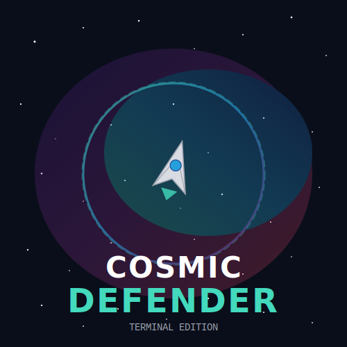

# 🚀 Cosmic Defender

##  Space Adventure on Windows

**Cosmic Defender** is an exciting space shooter game written in  and designed to run on Windows systems. Defend the galaxy from relentless alien invaders using only your ship and your wits!

## 📖 Table of Contents

- [Overview](#overview)
- [Features](#features)
- [Requirements](#requirements)
- [Installation](#installation)
- [How to Play](#how-to-play)
- [Controls](#controls)
- [Game Mechanics](#game-mechanics)

## Overview

In a distant future, humanity's last outpost is under attack from alien forces seeking to destroy everything in their path. As the pilot of the experimental spacecraft "Defender," you are tasked with protecting your home against waves of enemy ships, collecting power-ups, and upgrading your vessel to face increasingly difficult challenges.

Cosmic Defender brings classic arcade shooting action to your terminal window with colorful ASCII graphics, immersive sound effects (via console beeps), and challenging gameplay - all without leaving your command line.

"The cosmos awaits your defense, Commander. Good luck!"
